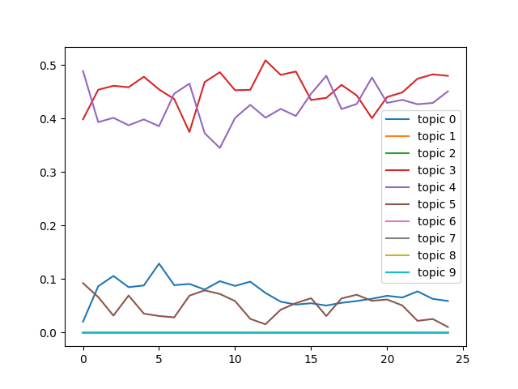

# DETM

## Result for Indian News Dataset


Topic 3 .. Time: 0 ===> ['anxiety', 'pressure', 'stress', 'say', 'time', 'people', 'feel', 'blood', 'help', 'life', 'high', 'find', 'study', disorder', 'like', 'work', 'increase', 'child', 'good']  
Topic 3 .. Time: 1 ===> ['anxiety', 'pressure', 'stress', 'time', 'say', 'blood', 'feel', 'people', 'help', 'high', 'life', 'find', 'study', disorder', 'like', 'work', 'sleep', 'increase', 'child']  
Topic 3 .. Time: 2 ===> ['anxiety', 'pressure', 'stress', 'say', 'feel', 'time', 'help', 'people', 'blood', 'life', 'find', 'high', 'study', 'like', 'sleep', 'disorder', 'work', 'increase', 'lead']  
Topic 3 .. Time: 3 ===> ['anxiety', 'stress', 'pressure', 'help', 'feel', 'say', 'time', 'life', 'find', 'people', 'study', 'sleep', 'blood', 'like', 'high', 'disorder', 'increase', 'work', 'child']  
Topic 3 .. Time: 4 ===> ['anxiety', 'stress', 'pressure', 'feel', 'help', 'time', 'find', 'life', 'study', 'say', 'people', 'like', 'high', 'blood', 'disorder', 'increase', 'lead', 'social', 'child']  
Topic 3 .. Time: 5 ===> ['anxiety', 'pressure', 'stress', 'feel', 'time', 'help', 'say', 'study', 'people', 'find', 'life', 'like', 'high', 'blood', 'disorder', 'lead', 'increase', 'work', 'child']  
Topic 3 .. Time: 6 ===> ['anxiety', 'pressure', 'stress', 'say', 'feel', 'time', 'study', 'help', 'people', 'find', 'blood', 'life', 'high', 'like', 'work', 'disorder', 'lead', 'increase', 'child']  
Topic 3 .. Time: 7 ===> ['anxiety', 'stress', 'say', 'study', 'pressure', 'feel', 'help', 'time', 'people', 'find', 'life', 'high', 'like', 'disorder', 'child', 'social', 'increase', 'blood', 'work']  
Topic 3 .. Time: 8 ===> ['anxiety', 'stress', 'pressure', 'say', 'feel', 'study', 'time', 'help', 'people', 'find', 'like', 'life', 'high', 'loneliness', 'social', 'sleep', 'child', 'researcher', 'increase']  
Topic 3 .. Time: 9 ===> ['anxiety', 'stress', 'study', 'feel', 'say', 'pressure', 'time', 'find', 'people', 'help', 'loneliness', 'life', 'disorder', 'high', 'like', 'increase', 'child', 'blood', 'sleep']  
Topic 3 .. Time: 10 ===> ['anxiety', 'stress', 'study', 'say', 'feel', 'time', 'help', 'find', 'people', 'pressure', 'disorder', 'life', 'loneliness', 'high', 'child', 'like', 'increase', 'way', 'work']  
Topic 3 .. Time: 11 ===> ['anxiety', 'stress', 'say', 'time', 'feel', 'study', 'people', 'help', 'pressure', 'find', 'life', 'disorder', 'like', 'child', 'high', 'loneliness', 'fear', 'way', 'work']  
Topic 3 .. Time: 12 ===> ['anxiety', 'stress', 'time', 'people', 'say', 'feel', 'help', 'fear', 'anxious', 'work', 'child', 'like', 'loneliness', 'find', 'social', 'home', 'increase', 'study', 'life']  
Topic 3 .. Time: 13 ===> ['anxiety', 'time', 'stress', 'people', 'feel', 'say', 'help', 'fear', 'anxious', 'home', 'like', 'work', 'loneliness', 'child', 'stay', 'increase', 'pressure', 'life', 'social']  
Topic 3 .. Time: 14 ===> ['anxiety', 'stress', 'time', 'feel', 'people', 'say', 'help', 'work', 'fear', 'pressure', 'anxious', 'like', 'find', 'life', 'increase', 'way', 'blood', 'high', 'loneliness']  
Topic 3 .. Time: 15 ===> ['anxiety', 'stress', 'feel', 'time', 'help', 'people', 'say', 'like', 'pressure', 'life', 'work', 'child', 'find', 'increase', 'loneliness', 'study', 'fear', 'anxious', 'way']  
Topic 3 .. Time: 16 ===> ['anxiety', 'stress', 'feel', 'time', 'help', 'people', 'say', 'pressure', 'like', 'life', 'work', 'study', 'child', 'find', 'increase', 'fear', 'high', 'lead', 'loneliness']  
Topic 3 .. Time: 17 ===> ['anxiety', 'stress', 'feel', 'time', 'say', 'people', 'help', 'pressure', 'study', 'find', 'like', 'work', 'life', 'blood', 'high', 'increase', 'disorder', 'child', 'depression']  
Topic 3 .. Time: 18 ===> ['anxiety', 'stress', 'feel', 'help', 'people', 'time', 'say', 'pressure', 'study', 'find', 'blood', 'life', 'like', 'work', 'disorder', 'high', 'increase', 'symptom', 'child']  
Topic 3 .. Time: 19 ===> ['anxiety', 'stress', 'help', 'feel', 'people', 'time', 'say', 'study', 'find', 'pressure', 'life', 'work', 'increase', 'high', 'like', 'experience', 'blood', 'social', 'child']  
Topic 3 .. Time: 20 ===> ['anxiety', 'stress', 'feel', 'help', 'people', 'pressure', 'study', 'time', 'say', 'blood', 'find', 'high', 'like', 'work', 'life', 'increase', 'reduce', 'experience', 'disorder']  
Topic 3 .. Time: 21 ===> ['anxiety', 'pressure', 'blood', 'stress', 'feel', 'help', 'people', 'say', 'high', 'study', 'time', 'find', 'heart', 'like', 'depression', 'work', 'reduce', 'life', 'symptom']  
Topic 3 .. Time: 22 ===> ['anxiety', 'stress', 'feel', 'pressure', 'help', 'people', 'say', 'blood', 'time', 'high', 'study', 'like', 'find', 'work', 'loneliness', 'depression', 'life', 'sleep', 'heart']  
Topic 3 .. Time: 23 ===> ['anxiety', 'stress', 'feel', 'help', 'pressure', 'people', 'time', 'say', 'blood', 'like', 'high', 'work', 'sleep', 'loneliness', 'study', 'find', 'life', 'depression', 'increase']  
Topic 3 .. Time: 24 ===> ['anxiety', 'stress', 'feel', 'help', 'pressure', 'people', 'time', 'say', 'like', 'work', 'blood', 'loneliness', 'sleep', 'life', 'study', 'find', 'high', 'depression', 'lead']  

Topic 4 .. Time: 0 ===> ['health', 'mental', 'issue', 'say', 'people', 'care', 'student', 'year', 'act', 'service', 'need', 'work', 'child', 'awareness', 'problem', 'state', 'professional', 'social', 'physical']  
Topic 4 .. Time: 1 ===> ['health', 'mental', 'issue', 'say', 'people', 'care', 'student', 'service', 'year', 'act', 'awareness', 'need', 'work', 'state', 'child', 'professional', 'problem', 'support', 'social']  
Topic 4 .. Time: 2 ===> ['health', 'mental', 'issue', 'say', 'people', 'care', 'student', 'service', 'need', 'year', 'social', 'problem', 'child', 'work', 'act', 'support', 'professional', 'awareness', 'institute']  
Topic 4 .. Time: 3 ===> ['health', 'mental', 'issue', 'say', 'people', 'student', 'care', 'service', 'need', 'social', 'problem', 'institute', 'year', 'help', 'support', 'state', 'physical', 'work', 'child']  
Topic 4 .. Time: 4 ===> ['health', 'mental', 'issue', 'say', 'people', 'student', 'care', 'service', 'need', 'social', 'problem', 'year', 'support', 'suicide', 'institute', 'help', 'state', 'work', 'physical']  
Topic 4 .. Time: 5 ===> ['health', 'mental', 'issue', 'say', 'people', 'student', 'need', 'social', 'problem', 'day', 'care', 'year', 'service', 'help', 'suicide', 'work', 'support', 'world', 'physical']  
Topic 4 .. Time: 6 ===> ['health', 'mental', 'issue', 'say', 'people', 'world', 'awareness', 'day', 'suicide', 'need', 'year', 'support', 'illness', 'social', 'student', 'national', 'problem', 'work', 'service']  
Topic 4 .. Time: 7 ===> ['health', 'mental', 'issue', 'world', 'say', 'day', 'awareness', 'people', 'need', 'support', 'illness', 'suicide', 'year', 'national', 'social', 'physical', 'problem', 'provide', 'india']  
Topic 4 .. Time: 8 ===> ['health', 'mental', 'issue', 'say', 'people', 'world', 'day', 'need', 'awareness', 'social', 'student', 'year', 'physical', 'support', 'help', 'problem', 'include', 'suicide', 'talk']  
Topic 4 .. Time: 9 ===> ['health', 'mental', 'issue', 'say', 'people', 'student', 'need', 'awareness', 'physical', 'world', 'help', 'year', 'social', 'include', 'problem', 'support', 'day', 'care', 'state']  
Topic 4 .. Time: 10 ===> ['health', 'mental', 'issue', 'say', 'people', 'student', 'need', 'awareness', 'physical', 'help', 'care', 'social', 'include', 'support', 'world', 'problem', 'state', 'institute', 'year']  
Topic 4 .. Time: 11 ===> ['health', 'mental', 'issue', 'say', 'people', 'student', 'need', 'help', 'physical', 'care', 'institute', 'support', 'awareness', 'professional', 'social', 'hospital', 'provide', 'national', 'medical']  
Topic 4 .. Time: 12 ===> ['health', 'mental', 'people', 'say', 'issue', 'coronavirus', 'covid-19', 'help', 'need', 'social', 'support', 'pandemic', 'quarantine', 'student', 'physical', 'care', 'government', 'crisis', 'professional']  
Topic 4 .. Time: 13 ===> ['health', 'mental', 'people', 'say', 'covid-19', 'lockdown', 'issue', 'pandemic', 'helpline', 'coronavirus', 'support', 'need', 'help', 'crisis', 'social', 'care', 'student', 'worker', 'provide']  
Topic 4 .. Time: 14 ===> ['health', 'mental', 'say', 'issue', 'people', 'covid-19', 'pandemic', 'lockdown', 'need', 'support', 'help', 'care', 'student', 'social', 'crisis', 'physical', 'worker', 'provide', 'impact']  
Topic 4 .. Time: 15 ===> ['health', 'mental', 'issue', 'say', 'people', 'covid-19', 'pandemic', 'need', 'care', 'student', 'social', 'support', 'help', 'physical', 'talk', 'impact', 'lockdown', 'crisis', 'professional']  
Topic 4 .. Time: 16 ===> ['health', 'mental', 'issue', 'say', 'people', 'pandemic', 'covid-19', 'care', 'need', 'student', 'physical', 'support', 'social', 'professional', 'help', 'impact', 'work', 'address', 'talk']  
Topic 4 .. Time: 17 ===> ['health', 'mental', 'issue', 'say', 'people', 'pandemic', 'covid-19', 'care', 'need', 'physical', 'student', 'work', 'support', 'social', 'help', 'professional', 'suicide', 'impact', 'patient']  
Topic 4 .. Time: 18 ===> ['health', 'mental', 'issue', 'say', 'pandemic', 'people', 'covid-19', 'need', 'care', 'world', 'suicide', 'work', 'physical', 'support', 'professional', 'help', 'social', 'day', 'student']  
Topic 4 .. Time: 19 ===> ['health', 'mental', 'issue', 'world', 'say', 'pandemic', 'people', 'day', 'covid-19', 'need', 'care', 'survey', 'work', 'support', 'impact', 'help', 'service', 'employee', 'country']  
Topic 4 .. Time: 20 ===> ['health', 'mental', 'issue', 'pandemic', 'people', 'say', 'covid-19', 'need', 'care', 'support', 'physical', 'service', 'student', 'impact', 'world', 'help', 'work', 'problem', 'employee']  
Topic 4 .. Time: 21 ===> ['health', 'mental', 'issue', 'say', 'pandemic', 'people', 'need', 'covid-19', 'care', 'physical', 'support', 'student', 'work', 'year', 'impact', 'employee', 'report', 'help', 'service']  
Topic 4 .. Time: 22 ===> ['health', 'mental', 'issue', 'say', 'pandemic', 'people', 'need', 'care', 'support', 'physical', 'covid-19', 'work', 'student', 'year', 'employee', 'impact', 'report', 'help', 'service']  
Topic 4 .. Time: 23 ===> ['health', 'mental', 'issue', 'say', 'pandemic', 'people', 'support', 'need', 'care', 'work', 'physical', 'year', 'covid-19', 'student', 'employee', 'impact', 'family', 'help', 'service']  
Topic 4 .. Time: 24 ===> ['health', 'mental', 'issue', 'say', 'pandemic', 'people', 'support', 'care', 'year', 'physical', 'struggle', 'work', 'family', 'need', 'impact', 'child', 'covid-19', 'royal', 'employee']  

Topic 0 .. Time: 0 ===> ['anxiety', 'say', 'lonely', 'pressure', 'year', 'election', 'film', 'world', 'come', 'new', 'time', 'global', 'india', 'month', 'loneliness', 'company', 'party', 'government', 'day']  
Topic 0 .. Time: 1 ===> ['anxiety', 'say', 'lonely', 'pressure', 'year', 'election', 'film', 'world', 'come', 'new', 'global', 'time', 'india', 'month', 'company', 'loneliness', 'party', 'market', 'government']  
Topic 0 .. Time: 2 ===> ['anxiety', 'lonely', 'pressure', 'say', 'year', 'election', 'film', 'trade', 'new', 'come', 'market', 'world', 'china', 'government', 'global', 'india', 'month', 'company', 'party']  
Topic 0 .. Time: 3 ===> ['anxiety', 'pressure', 'lonely', 'say', 'year', 'film', 'trade', 'new', 'world', 'government', 'market', 'come', 'u.s.', 'india', 'day', 'china', 'old', 'share', 'month']  
Topic 0 .. Time: 4 ===> ['anxiety', 'lonely', 'pressure', 'say', 'year', 'market', 'new', 'government', '>', 'film', 'world', 'trade', 'india', 'day', 'u.s.', 'come', 'share', 'credit', 'china']  
Topic 0 .. Time: 5 ===> ['anxiety', 'lonely', 'pressure', 'say', 'year', 'trump', 'shooting', 'mass', 'new', 'market', 'kong', 'hong', 'kashmir', 'gun', 'president', 'bestseller', 'trade', '>', 'credit']  
Topic 0 .. Time: 6 ===> ['anxiety', 'lonely', 'say', 'pressure', 'year', 'new', 'ago', 'film', 'gun', 'day', 'credit', 'old', 'point', '>', 'india', 'come', 'embed', '<', 'publish']  
Topic 0 .. Time: 7 ===> ['anxiety', 'lonely', 'say', 'year', 'pressure', 'day', 'world', 'credit', 'new', 'ago', '>', 'film', '<', 'embed', 'old', 'week', 'range', 'come', 'global']  
Topic 0 .. Time: 8 ===> ['anxiety', 'lonely', 'pressure', 'say', 'year', 'ago', 'go', 'day', 'new', 'come', 'old', 'film', 'loneliness', 'end', 'man', 'police', 'look', 'play', 'world']  
Topic 0 .. Time: 9 ===> ['anxiety', 'lonely', 'year', 'pressure', 'say', 'new', 'go', 'come', 'india', 'film', 'ago', 'old', 'police', 'loneliness', 'month', 'government', 'play', 'company', 'book']  
Topic 0 .. Time: 10 ===> ['anxiety', 'lonely', 'year', 'say', 'pressure', 'new', 'go', 'ago', 'come', 'market', 'india', 'old', 'china', 'world', 'tell', 'country', '2020', 'government', 'police']  
Topic 0 .. Time: 11 ===> ['anxiety', 'lonely', 'pressure', 'say', 'year', 'china', 'new', 'market', 'virus', 'world', 'day', 'government', 'week', 'go', 'india', 'come', 'old', 'global', 'big']  
Topic 0 .. Time: 12 ===> ['anxiety', 'say', 'pressure', 'coronavirus', 'lonely', 'year', 'new', 'virus', 'home', 'spread', 'day', 'government', 'week', 'world', 'global', 'price', 'march', 'market', 'outbreak']  
Topic 0 .. Time: 13 ===> ['anxiety', 'say', 'pressure', 'lonely', 'year', 'lockdown', 'coronavirus', 'home', 'government', 'day', 'new', 'time', 'world', 'economy', 'come', 'virus', 'global', 'week', 'country']  
Topic 0 .. Time: 14 ===> ['anxiety', 'pressure', 'say', 'lonely', 'year', 'new', 'come', 'old', 'government', 'lockdown', 'ago', 'coronavirus', 'day', 'home', 'economy', 'return', 'week', 'go', 'world']  
Topic 0 .. Time: 15 ===> ['anxiety', 'say', 'year', 'pressure', 'lonely', 'police', 'ago', 'film', 'come', 'new', 'old', 'industry', 'loneliness', 'government', 'write', 'coronavirus', 'month', 'actor', 'day']  
Topic 0 .. Time: 16 ===> ['anxiety', 'pressure', 'say', 'year', 'lonely', 'come', 'write', 'new', 'old', 'month', 'government', 'loneliness', 'go', 'july', 'film', 'state', 'tell', 'time', 'open']  
Topic 0 .. Time: 17 ===> ['anxiety', 'pressure', 'say', '�', 'year', 'lonely', 'come', 'new', 'month', 'government', 'write', 'loneliness', 'old', 'time', 'state', 'tell', 'home', 'leave', 'film']  
Topic 0 .. Time: 18 ===> ['anxiety', 'say', 'year', 'lonely', 'pressure', 'new', 'police', 'come', 'old', 'tell', 'government', 'loneliness', 'write', 'month', 'film', 'family', 'man', 'time', 'home']  
Topic 0 .. Time: 19 ===> ['lonely', 'anxiety', 'say', 'ago', 'pressure', 'year', 'new', 'day', 'bieber', 'world', 'video', 'justin', 'film', 'trump', '2020', 'rt', 'election', 'come', 'open']  
Topic 0 .. Time: 20 ===> ['lonely', 'say', 'anxiety', 'election', 'pressure', 'year', 'new', 'come', 'day', 'market', 'trump', 'biden', 'government', '2020', 'president', 'party', 'vote', 'time', 'loneliness']  
Topic 0 .. Time: 21 ===> ['say', 'lonely', 'pressure', 'year', 'anxiety', 'new', 'come', '2020', 'vaccine', 'loneliness', 'government', 'hope', 'india', 'old', 'home', 'write', 'tell', 'day', 'take']  
Topic 0 .. Time: 22 ===> ['say', 'pressure', 'anxiety', 'lonely', 'year', 'new', 'come', 'vaccine', 'day', 'government', 'court', 'charge', 'assange', 'loneliness', 'share', 'farmer', 'india', 'old', 'leave']  
Topic 0 .. Time: 23 ===> ['anxiety', 'say', 'pressure', 'lonely', 'year', 'loneliness', 'come', 'new', 'day', 'market', 'share', 'government', 'go', 'modi', 'old', 'time', 'like', 'leave', 'hope']  
Topic 0 .. Time: 24 ===> ['lonely', 'anxiety', 'say', 'pressure', 'year', 'loneliness', 'old', 'come', 'range', 'new', 'share', 'go', 'world', 'time', 'leave', 'government', 'like', 'face', 'point']  

Topic 5 .. Time: 0 ===> ['low', 'pressure', 'spears', 'ocean', 'area', 'bengal', 'likely', 'bay', 'britney', 'indian', 'equatorial', 'april', 'tamil', 'nadu', 'intensify', 'department', 'adjoin', 'southeast', 'imd']  
Topic 5 .. Time: 1 ===> ['low', 'pressure', 'area', 'bengal', 'likely', 'bay', 'ocean', 'spears', 'indian', 'equatorial', 'intensify', 'britney', 'adjoin', 'department', 'tamil', 'nadu', 'imd', 'april', 'southeast']  
Topic 5 .. Time: 2 ===> ['low', 'pressure', 'area', 'likely', 'bengal', 'bay', 'department', 'depression', 'say', 'indian', 'imd', 'form', 'intensify', 'cyclone', 'sea', 'adjoin', 'east', 'south', 'southeast']  
Topic 5 .. Time: 3 ===> ['low', 'pressure', 'area', 'likely', 'bengal', 'sea', 'imd', 'bay', 'depression', 'form', 'department', 'monsoon', 'rainfall', 'north', 'heavy', 'cyclone', 'east', 'arabian', 'say']  
Topic 5 .. Time: 4 ===> ['pressure', 'low', 'area', 'likely', 'depression', 'form', 'say', 'bengal', 'sea', 'bay', 'heavy', 'north', 'department', 'imd', 'west', 'rainfall', 'monsoon', 'system', 'south']  
Topic 5 .. Time: 5 ===> ['pressure', 'low', 'area', 'likely', 'depression', 'say', 'form', 'bengal', 'sea', 'bay', 'heavy', 'north', 'west', 'south', 'central', 'imd', 'rainfall', 'east', 'system']  
Topic 5 .. Time: 6 ===> ['pressure', 'low', 'area', 'likely', 'say', 'sea', 'form', 'depression', 'bengal', 'west', 'bay', 'north', 'heavy', 'south', 'mark', 'central', 'east', 'arabian', 'imd']  
Topic 5 .. Time: 7 ===> ['low', 'pressure', 'area', 'sea', 'likely', 'bengal', 'bay', 'form', 'arabian', 'west', 'mark', 'depression', 'east', 'south', 'say', 'north', 'imd', 'coast', 'heavy']  
Topic 5 .. Time: 8 ===> ['low', 'pressure', 'cricket', 'australia', 'area', 'maxwell', 'break', 'sea', 'glenn', 'say', 'likely', 'west', 'take', 'mark', 'form', 'south', 'batsman', 'cricketer', 'bengal']  
Topic 5 .. Time: 9 ===> ['break', 'cricket', 'maxwell', 'pressure', 'low', 'area', 'take', 'australia', 'say', 'sea', 'glenn', 'south', 'west', 'likely', 'mark', 'form', 'india', 'australian', 'east']  
Topic 5 .. Time: 10 ===> ['take', 'break', 'crystal', 'award', 'say', 'deepika', 'maxwell', 'pressure', 'state', 'area', 'padukone', 'davos', 'cricket', 'forum', 'low', 'india', 'contribution', 'australia', 'caa']  
Topic 5 .. Time: 11 ===> ['take', 'say', 'state', 'pressure', 'break', 'india', 'area', 'low', 'deepika', 'mark', 'month', 'south', 'news', 'day', 'coronavirus', 'school', 'likely', 'padukone', 'form']  
Topic 5 .. Time: 12 ===> ['say', 'take', 'pressure', 'state', 'coronavirus', 'news', 'lockdown', 'month', 'low', 'india', 'area', 'mark', 'school', 'day', 'likely', 'key', 'south', 'miss', 'form']  
Topic 5 .. Time: 13 ===> ['lockdown', 'news', 'coronavirus', 'miss', 'lesson', 'click', 'key', 'pressure', 'state', 'month', 'israeli', 'take', 'telegram', 'angst', 'shetty', 'herald', 'healthy', 'say', 'hug']  
Topic 5 .. Time: 14 ===> ['low', 'pressure', 'area', 'sea', 'likely', 'imd', 'arabian', 'south', 'depression', 'form', 'bengal', 'bay', 'say', 'southeast', 'east', 'cyclonic', 'mark', 'coast', 'intensify']  
Topic 5 .. Time: 15 ===> ['sushant', 'pressure', 'area', 'low', 'singh', 'rajput', 'june', 'say', 'depression', 'sea', 'likely', 'actor', 'imd', 'arabian', 'india', 'form', 'department', 'south', 'bengal']  
Topic 5 .. Time: 16 ===> ['sushant', 'singh', 'pressure', 'rajput', 'low', 'actor', 'say', 'area', 'depression', 'mumbai', 'death', 'likely', 'india', 'june', 'bollywood', 'central', 'west', 'bengal', 'form']  
Topic 5 .. Time: 17 ===> ['sushant', 'pressure', 'singh', 'rajput', 'low', 'area', 'say', 'actor', 'rhea', 'bengal', 'depression', 'likely', 'central', 'heavy', 'mumbai', 'death', 'bay', 'west', 'india']  
Topic 5 .. Time: 18 ===> ['sushant', 'singh', 'rajput', 'rhea', 'pressure', 'actor', 'say', 'low', 'sister', 'priyanka', 'chakraborty', 'area', 'drug', 'death', 'mumbai', 'medicine', 'central', 'police', 'prescription']  
Topic 5 .. Time: 19 ===> ['pressure', 'low', 'area', 'bengal', 'bay', 'likely', 'heavy', 'central', 'depression', 'sea', 'say', 'imd', 'south', 'rainfall', 'form', 'north', 'mark', 'intensify', 'west']  
Topic 5 .. Time: 20 ===> ['low', 'pressure', 'area', 'bengal', 'bay', 'likely', 'south', 'sea', 'imd', 'depression', 'heavy', 'mark', 'say', 'adjoin', 'intensify', 'form', 'tamil', 'nadu', 'coast']  
Topic 5 .. Time: 21 ===> ['pressure', 'say', 'national', 'area', 'institute', 'low', 'centre', 'india', 'december', 'delhi', 'depression', 'biology', 'likely', 'south', 'indian', 'mark', 'state', 'department', 'cellular']  
Topic 5 .. Time: 22 ===> ['say', 'institute', 'national', 'pressure', 'centre', 'delhi', 'vaccine', 'india', 'area', 'biology', 'low', 'indian', 'state', 'bengaluru', 'sciences', 'sample', 'depression', 'neha', 'pune']  
Topic 5 .. Time: 23 ===> ['say', 'institute', 'national', 'pressure', 'neha', 'vaccine', 'centre', 'delhi', 'kakkar', 'india', 'indian', 'issue', 'state', '12', 'hospital', 'bengaluru', 'contestant', 'standard', 'low']  
Topic 5 .. Time: 24 ===> ['say', 'pressure', 'national', 'institute', 'centre', 'delhi', 'india', 'vaccine', 'indian', 'issue', 'state', 'neha', 'day', 'anxiety', 'new', '12', 'hospital', 'low', 'health']  

## Example
```
python main.py --dataset indian_news --data_path datasets/processed/ --emb_path datasets/processed/embedding.json --train_embeddings 1  --num_topics 10 --lr 0.001 --lr_factor 1.0 --seed 9999 --epochs 200 --mode eval --load_from ./results/detm_indian_news_K_10_Htheta_800_Optim_adam_Clip_0.0_ThetaAct_relu_Lr_0.001_Bsz_256_RhoSize_100_L_3_minDF_100_trainEmbeddings_1
```


## Citation
```
@article{dieng2019dynamic,
  title={The Dynamic Embedded Topic Model},
  author={Dieng, Adji B and Ruiz, Francisco JR and Blei, David M},
  journal={arXiv preprint arXiv:1907.05545},
  year={2019}
}
```


